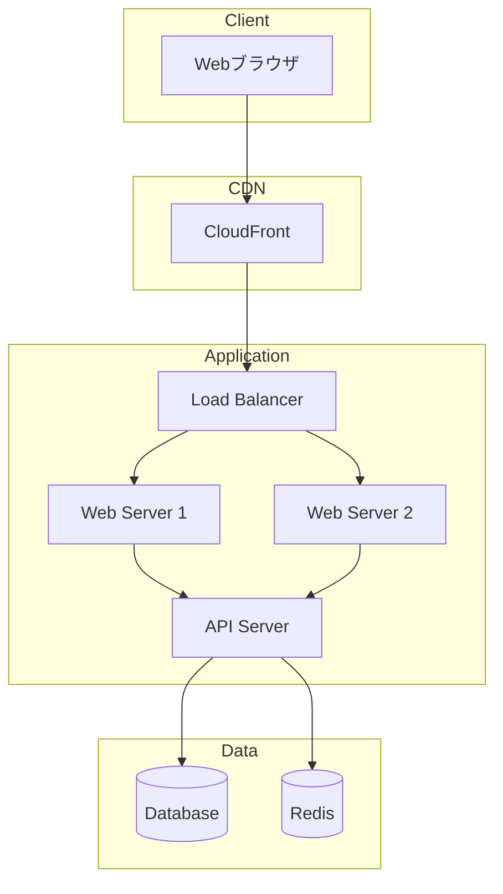
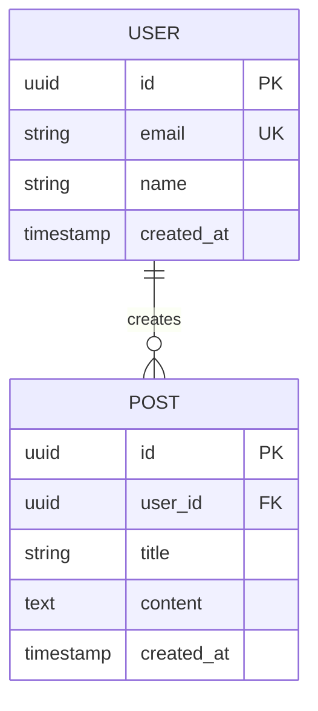
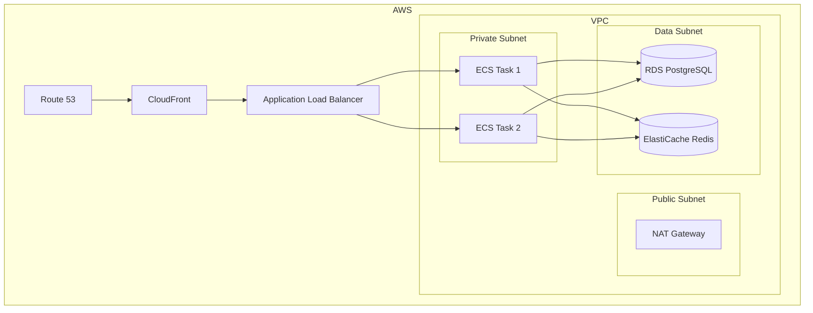

# アーキテクチャ設計書

## 1. システム概要

### 1.1 アーキテクチャ原則
- スケーラビリティ
- 保守性
- セキュリティ
- パフォーマンス

### 1.2 技術スタック概要
| レイヤー | 技術 | バージョン | 選定理由 |
|---------|------|-----------|---------|
| Frontend | React | 19.x | PRD指定。最新の並行レンダリング機能、Server Components対応 |
| Backend | Rails API | 7.x | 既存バックエンド。堅牢なORM、セキュリティ機能 |
| 状態管理 | TanStack Query | 5.x | サーバー状態管理に最適。キャッシュ、楽観的更新 |
| スタイリング | Tailwind CSS | 3.x | 高速開発、デザインの一貫性、バンドルサイズ最適化 |
| フォーム | React Hook Form + Zod | - | 高パフォーマンス、型安全なバリデーション |
| ビルドツール | Vite | 5.x | 高速な開発サーバー、最適化されたビルド |

## 2. システム構成

### 2.1 全体アーキテクチャ図



### 2.2 レイヤー構成

```
┌─────────────────────────────────┐
│     Presentation Layer          │  UI Components, Pages
├─────────────────────────────────┤
│     Application Layer           │  Business Logic, Use Cases
├─────────────────────────────────┤
│     Domain Layer                │  Domain Models, Business Rules
├─────────────────────────────────┤
│     Infrastructure Layer        │  Database, External APIs
└─────────────────────────────────┘
```

## 3. フロントエンド設計

### 3.1 技術スタック
<!--
各技術について選定理由を記載してください。
選定基準の例:
- パフォーマンス: 実行速度、バンドルサイズ
- 開発体験: 学習コスト、開発効率、エコシステム
- コミュニティ: ドキュメント、サポート、採用事例
- 保守性: 長期サポート、移行コスト
- チームスキル: 既存の知識・経験
-->

- **フレームワーク**: React 18.x + TypeScript
  <!-- 選定理由: 豊富なエコシステム、並行レンダリング、型安全性 -->
- **状態管理**: <!-- Redux Toolkit / Zustand / Jotaiから選択 -->
  <!-- 選定理由: 規模に応じて選択。大規模ならRedux、中小規模ならZustand/Jotai -->
- **ルーティング**: React Router v6
  <!-- 選定理由: デファクトスタンダード、宣言的API、ネストルーティング -->
- **UIライブラリ**: <!-- Material-UI / Chakra UI / shadcn/uiから選択 -->
  <!-- 選定理由: デザインシステム、アクセシビリティ、カスタマイズ性 -->
- **スタイリング**: <!-- CSS Modules / Tailwind CSS / Emotionから選択 -->
  <!-- 選定理由: 開発速度、デザインの一貫性、バンドルサイズ -->
- **フォーム**: React Hook Form + Zod
  <!-- 選定理由: 高パフォーマンス(非制御コンポーネント)、型安全なバリデーション -->
- **データフェッチ**: TanStack Query (React Query)
  <!-- 選定理由: サーバー状態管理に最適、キャッシュ、楽観的更新 -->
- **テスト**: Vitest + Testing Library
  <!-- 選定理由: 高速、Viteとの親和性、React Testing Libraryのベストプラクティス -->
- **ビルド**: Vite
  <!-- 選定理由: 高速な開発サーバー、最適化されたプロダクションビルド -->

### 3.2 ディレクトリ構成
```
src/
├── components/          # 再利用可能なコンポーネント
│   ├── ui/             # 基本UIコンポーネント
│   └── features/       # 機能別コンポーネント
├── pages/              # ページコンポーネント
├── hooks/              # カスタムフック
├── store/              # 状態管理
├── api/                # APIクライアント
├── types/              # 型定義
├── utils/              # ユーティリティ関数
└── styles/             # グローバルスタイル
```

### 3.3 コンポーネント設計原則
- Atomic Design パターン
- Container/Presentational パターン
- Compound Component パターン
- 単一責任の原則

### 3.4 状態管理戦略
- **グローバル状態**: Redux Toolkit
- **サーバー状態**: TanStack Query
- **フォーム状態**: React Hook Form
- **URL状態**: React Router

## 4. バックエンド設計

### 4.1 技術スタック
<!--
バックエンドの技術選定について、以下の観点で選定理由を記載:
- パフォーマンス: スループット、レイテンシ
- 型安全性: TypeScript対応、自動補完
- 開発体験: ボイラープレート削減、開発効率
- スケーラビリティ: 水平スケーリング、マイクロサービス対応
-->

- **ランタイム**: Node.js 20.x + TypeScript
  <!-- 選定理由: フロントエンドと言語統一、豊富なライブラリ、型安全性 -->
- **フレームワーク**: <!-- Express / Fastify / NestJSから選択 -->
  <!--
  選定理由の例:
  - Express: シンプル、学習コスト低、豊富なミドルウェア
  - Fastify: 高速、スキーマベース、モダンAPI
  - NestJS: エンタープライズ向け、DI、モジュラー設計
  -->
- **ORM**: <!-- Prisma / TypeORM / Drizzleから選択 -->
  <!--
  選定理由の例:
  - Prisma: 型安全、優れたDX、マイグレーション管理
  - TypeORM: 多機能、Active Record/Data Mapper対応
  - Drizzle: 軽量、高速、SQL-like API
  -->
- **バリデーション**: <!-- Zod / class-validatorから選択 -->
  <!-- 選定理由: 型推論、ランタイム検証、エラーメッセージ -->
- **認証**: <!-- Passport.js / Auth.jsから選択 -->
  <!-- 選定理由: 戦略パターン、OAuth対応、セッション管理 -->
- **テスト**: <!-- Jest / Vitestから選択 -->
  <!-- 選定理由: テストランナー速度、型サポート、モックの容易性 -->
- **API仕様**: OpenAPI 3.0
  <!-- 選定理由: ドキュメント自動生成、型定義生成、API設計標準化 -->

### 4.2 アーキテクチャパターン
- **Clean Architecture**
- **レイヤードアーキテクチャ**
- **CQRS** (必要に応じて)

### 4.3 API設計
- RESTful API
- エンドポイント命名規則
- バージョニング戦略
- エラーハンドリング標準

### 4.4 ディレクトリ構成
```
src/
├── controllers/        # コントローラー
├── services/           # ビジネスロジック
├── repositories/       # データアクセス層
├── models/             # ドメインモデル
├── middlewares/        # ミドルウェア
├── validators/         # バリデーション
├── types/              # 型定義
└── utils/              # ユーティリティ
```

## 5. データベース設計

### 5.1 データベース選定
- **RDBMS**: PostgreSQL 15.x
- **理由**: ACID特性、豊富な機能、パフォーマンス

### 5.2 ER図


### 5.3 インデックス戦略
- プライマリキー
- 外部キー
- 検索用インデックス
- 複合インデックス

### 5.4 スケーリング戦略
- リードレプリカ
- パーティショニング
- シャーディング(将来的に)

## 6. インフラストラクチャ

### 6.1 クラウドプロバイダー
- **選定**: <!-- AWS / GCP / Azureから選択 -->
- **理由**:
  <!--
  選定理由を記載:
  - コスト: 従量課金モデル、予算との適合性
  - 既存インフラとの親和性: 既存システムとの統合容易性
  - チームの習熟度: 開発チームの経験・スキル
  - 必要な機能の提供状況: マネージドサービスの充実度
  - リージョン: データセンターの地理的配置
  - サポート体制: 技術サポートの品質・対応時間
  -->

### 6.2 インフラ構成図


### 6.3 デプロイメント
- **コンテナ化**: Docker
- **オーケストレーション**: ECS / Kubernetes
- **CI/CD**: GitHub Actions / GitLab CI
- **IaC**: Terraform / CDK

### 6.4 環境構成
- **開発環境** (Development)
- **ステージング環境** (Staging)
- **本番環境** (Production)

## 7. セキュリティ設計

### 7.1 認証・認可
- **認証方式**: <!-- JWT / OAuth 2.0 / OpenID Connectから選択、または組み合わせ -->
  <!--
  選定理由の例:
  - JWT: ステートレス、スケーラブル、モバイルアプリ対応
  - OAuth 2.0: 外部サービス連携、ソーシャルログイン
  - OpenID Connect: IDトークン、ユーザー情報の標準化
  -->
- **セッション管理**: Redis
  <!-- 選定理由: 高速、永続化、分散環境対応 -->
- **パスワード**: <!-- bcrypt / Argon2から選択 -->
  <!--
  選定理由の例:
  - bcrypt: 実績豊富、広く採用
  - Argon2: 最新アルゴリズム、PHC推奨、メモリハード
  -->

### 7.2 通信セキュリティ
- HTTPS強制
- TLS 1.3
- CORS設定
- CSP (Content Security Policy)

### 7.3 データ保護
- 個人情報の暗号化
- バックアップ戦略
- ログ管理

### 7.4 脆弱性対策
- XSS対策
- CSRF対策
- SQLインジェクション対策
- 依存関係の脆弱性スキャン

## 8. パフォーマンス設計

### 8.1 キャッシュ戦略
- **CDN**: CloudFront
- **アプリケーションキャッシュ**: Redis
- **ブラウザキャッシュ**: Cache-Control

### 8.2 最適化手法
- コード分割
- 遅延ロード
- 画像最適化
- データベースクエリ最適化

### 8.3 監視指標
- レスポンスタイム
- スループット
- エラーレート
- リソース使用率

## 9. 監視・ログ

### 9.1 監視ツール
- **APM**: <!-- Datadog / New Relic / CloudWatchから選択 -->
  <!--
  選定理由の例:
  - Datadog: 統合監視、豊富な機能、ダッシュボード
  - New Relic: APM特化、トレーシング、リアルタイム分析
  - CloudWatch: AWS統合、コスト効率
  -->
- **ログ集約**: <!-- CloudWatch Logs / ELK Stackから選択 -->
  <!--
  選定理由の例:
  - CloudWatch Logs: AWS統合、シンプル、コスト効率
  - ELK Stack: 高機能、柔軟な検索、可視化
  -->
- **アラート**: <!-- PagerDuty / Slackから選択、または併用 -->
  <!--
  選定理由の例:
  - PagerDuty: オンコール管理、エスカレーション
  - Slack: チーム連携、カスタマイズ性
  -->

### 9.2 ログレベル
- ERROR: エラー
- WARN: 警告
- INFO: 情報
- DEBUG: デバッグ

### 9.3 メトリクス
- ビジネスメトリクス
- システムメトリクス
- カスタムメトリクス

## 10. 開発環境

### 10.1 ローカル開発環境
- Docker Compose
- 環境変数管理
- ホットリロード

### 10.2 開発ツール
- **エディタ**: VSCode推奨
- **Linter**: ESLint
- **Formatter**: Prettier
- **型チェック**: TypeScript
- **Git Hooks**: Husky + lint-staged

## 11. 外部サービス連携

### 11.1 外部API
| サービス | 用途 | 認証方式 |
|---------|------|---------|
| Stripe | 決済 | API Key |

### 11.2 SaaS/PaaS
<!--
外部SaaS/PaaSサービスについて、選定理由を記載
- 認証: <!-- Auth0 / Firebase Authから選択 -->
  <!--
  選定理由の例:
  - Auth0: エンタープライズ向け、多機能、コンプライアンス対応
  - Firebase Auth: Google統合、リアルタイム、コスト効率
  -->
- メール送信: <!-- SendGrid / AWS SESから選択 -->
  <!--
  選定理由の例:
  - SendGrid: 高機能、テンプレート、分析
  - AWS SES: コスト効率、AWS統合、シンプル
  -->
- ファイルストレージ: S3
  <!-- 選定理由: 高可用性、スケーラブル、CDN統合 -->

## 12. 災害復旧・事業継続

### 12.1 バックアップ戦略
- データベース: 自動バックアップ(日次)
- ファイル: S3バージョニング
- 保持期間: 30日

### 12.2 障害対策
- マルチAZ構成
- 自動フェイルオーバー
- ヘルスチェック

### 12.3 復旧手順
- RTO (Recovery Time Objective)
- RPO (Recovery Point Objective)
- 復旧手順書
