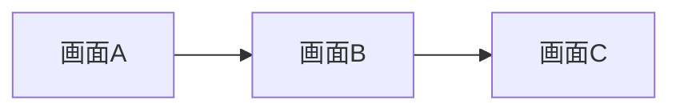
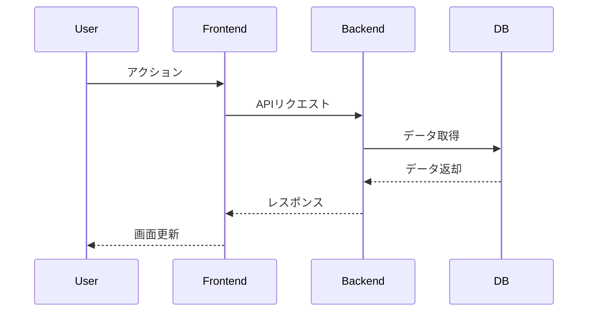
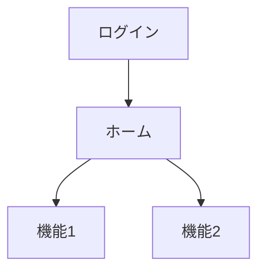
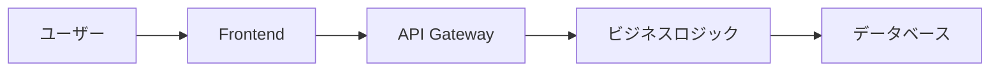

# 機能設計書

## 1. 機能一覧

| 機能ID | 機能名 | 優先度 | 状態 |
|--------|--------|--------|------|
| F001   | xxx    | Must   | 未着手 |

## 2. 機能詳細設計

### F001: [機能名]

#### 2.1 概要
- 機能の目的と概要
- 対応するPRDのセクション参照

#### 2.2 画面仕様

##### 2.2.1 画面構成
- ワイヤーフレーム(Mermaid/ASCII art)
- レイアウト構造
- コンポーネント配置

##### 2.2.2 UI要素
| 要素ID | 種類 | ラベル | 初期値 | 必須 | バリデーション |
|--------|------|--------|--------|------|----------------|
| E001   | Input | ユーザー名 | - | Yes | 3-20文字 |

##### 2.2.3 画面遷移


#### 2.3 処理フロー

##### 2.3.1 正常系フロー


##### 2.3.2 異常系フロー
- エラーケース1
- エラーケース2
- リカバリー処理

#### 2.4 データ仕様

##### 2.4.1 入力データ
| 項目名 | 型 | 必須 | 制約 | 備考 |
|--------|-----|------|------|------|
| userId | string | Yes | UUID | ユーザーID |

##### 2.4.2 出力データ
| 項目名 | 型 | 必須 | 制約 | 備考 |
|--------|-----|------|------|------|
| result | object | Yes | - | 処理結果 |

##### 2.4.3 状態管理
- 管理する状態の一覧
- 状態遷移図
- 状態の永続化方法

#### 2.5 API仕様

##### 2.5.1 エンドポイント定義
```
POST /api/v1/users
```

##### 2.5.2 リクエスト
```json
{
  "username": "string",
  "email": "string"
}
```

##### 2.5.3 レスポンス
```json
{
  "id": "string",
  "username": "string",
  "createdAt": "ISO8601"
}
```

##### 2.5.4 エラーレスポンス
| ステータスコード | エラーコード | 説明 |
|-----------------|--------------|------|
| 400 | INVALID_INPUT | 入力値が不正 |

#### 2.6 ビジネスロジック
- 主要な計算ロジック
- バリデーションルール
- 業務ルール

#### 2.7 セキュリティ考慮事項
- 認証・認可要件
- 入力値検証
- XSS/CSRF対策
- データ暗号化

#### 2.8 パフォーマンス要件
- レスポンスタイム目標
- スループット要件
- キャッシュ戦略

#### 2.9 テストケース
| テストID | テスト内容 | 期待結果 |
|----------|------------|----------|
| TC001    | 正常入力   | 成功     |

## 3. 画面遷移図(全体)



## 4. データフロー図(全体)



## 5. 外部連携仕様

### 5.1 外部API連携
- 連携先API一覧
- 認証方式
- エラーハンドリング

### 5.2 Webhook仕様
- イベント種類
- ペイロード形式
- リトライポリシー
