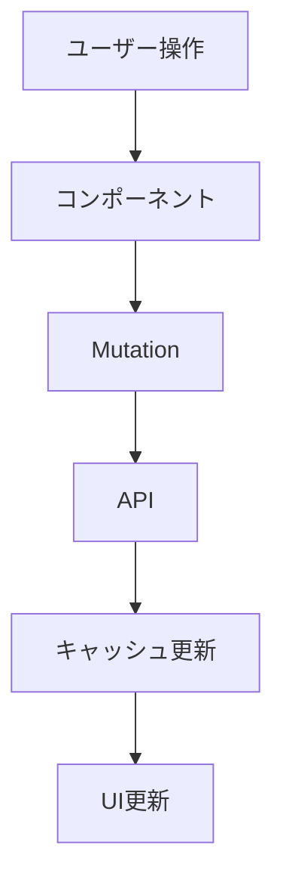

# SDD開発環境の構築プラン

## 概要

既存のJuku Cloud Frontendプロジェクトに**Specification-Driven Development (SDD)**の開発環境を構築します。永続的なプロダクトドキュメント（`docs/`）、作業単位の仕様管理（`.steering/`）、Claude Code活用のための設定（`.claude/`）を整備し、実務的なSDD開発フローを確立します。

**目的:**
- 実務を想定したSDD開発環境の構築
- プロダクト全体の設計ドキュメントと個別作業仕様の分離
- Claude Code（agents/skills/commands）をフル活用した効率的な開発フロー

**スコープ:**
- 今回: ディレクトリ構造とテンプレートの作成のみ
- 次回以降: 実際の機能開発（studentTraitsなど）で運用開始

---

## ディレクトリ構造の全体像

```
juku-cloud-frontend/
├── docs/                                    # 永続的プロダクトドキュメント
│   ├── product-requirements.md             # プロダクト要求定義書
│   ├── functional-design.md                # 機能設計書
│   ├── architecture.md                     # 技術仕様書
│   ├── repository-structure.md             # リポジトリ構造定義書
│   ├── development-guidelines.md           # 開発ガイドライン
│   └── glossary.md                         # ユビキタス言語定義
│
├── .steering/                               # 作業単位の仕様管理
│   └── [YYYYMMDD]-[開発の内容]/            # 例: 20250115-studenttraits-sdd
│       ├── design.md                       # 設計ドキュメント
│       ├── requirements.md                 # 要求仕様
│       └── tasklist.md                     # タスクリスト
│
├── .claude/                                 # Claude Code設定
│   ├── agents/                             # カスタムサブエージェント
│   ├── command/                            # スラッシュコマンド
│   ├── skill/                              # スキル定義
│   └── CLAUDE.md                           # Claude用プロジェクト説明書
│
├── .github/                                 # 既存: GitHub設定
├── src/                                     # 既存: ソースコード
└── ...（その他既存ファイル）
```

---

## フェーズ1: docs/ - 永続的プロダクトドキュメントの作成

### 1.1 ディレクトリ作成

新規作成: `docs/`

### 1.2 各ドキュメントの役割と初期テンプレート

#### 1.2.1 product-requirements.md（プロダクト要求定義書）

**役割:**
- プロダクト全体のビジョンと目的
- ターゲットユーザーと課題・ニーズ
- 主要な機能一覧
- 成功の定義
- ビジネス要件
- ユーザーストーリー
- 受け入れ条件
- 機能要件
- 非機能要件

**テンプレート構成:**
```markdown
# プロダクト要求定義書

## プロダクトビジョンと目的

### プロダクトビジョン
[このプロダクトが目指すもの]

### 目的
- [目的1]
- [目的2]

## ターゲットユーザーと課題・ニーズ

### ターゲットユーザー
| ロール | 説明 | 主な利用シーン |
|--------|------|---------------|

### 解決したい課題
- [課題1]
- [課題2]

### ユーザーニーズ
- [ニーズ1]
- [ニーズ2]

## 主要な機能一覧

### 1. [機能カテゴリ1]
- [機能1-1]
- [機能1-2]

### 2. [機能カテゴリ2]
- [機能2-1]
- [機能2-2]

## 成功の定義

### KPI（重要業績評価指標）
- [指標1]: [目標値]
- [指標2]: [目標値]

### 成功条件
- [ ] [条件1]
- [ ] [条件2]

## ビジネス要件

### ビジネス目標
- [目標1]
- [目標2]

### 収益モデル（想定）
- [収益モデルの説明]

### 市場要件
- [市場要件の説明]

## ユーザーストーリー

### [ユーザーロール]視点
**US-001**: [ストーリー名]
- **As a** [ロール]
- **I want to** [アクション]
- **So that** [目的]

## 受け入れ条件

### AC-001: [機能名]（US-001関連）
- **GIVEN** [前提条件]
- **WHEN** [操作]
- **THEN** [期待結果]
- **AND** [追加条件]

## 機能要件

### 必須機能（MVP）
1. [機能1]
2. [機能2]

### 優先度高
1. [機能1]
2. [機能2]

### 優先度中
1. [機能1]
2. [機能2]

## 非機能要件

### パフォーマンス
- [要求内容]

### セキュリティ
- [要求内容]

### アクセシビリティ
- [要求内容]

### 互換性
- **ブラウザ**: [対応ブラウザ]
- **デバイス**: [対応デバイス]

### 可用性
- [要求内容]

### 保守性
- [要求内容]

## 制約事項

### 技術的制約
- [制約1]
- [制約2]

### ビジネス的制約
- [制約1]
- [制約2]

### 法的・規制的制約
- [制約1]
- [制約2]

## 前提条件
- [前提1]
- [前提2]

## 依存関係
- [依存関係1]
- [依存関係2]

## 用語集
詳細は [glossary.md](./glossary.md) を参照。

## 変更履歴
| 日付 | バージョン | 変更内容 | 担当者 |
|------|-----------|---------|--------|
| YYYY-MM-DD | 1.0 | 初版作成 | - |
```

#### 1.2.2 functional-design.md（機能設計書）

**役割:**
- 機能ごとのアーキテクチャ
- システム構成図
- データモデル定義（ER図含む）
- コンポーネント設計
- ユースケース図、画面遷移図、ワイヤフレーム
- API設計（将来的にバックエンドと連携する場合）

**テンプレート構成:**
```markdown
# 機能設計書

## 機能一覧
| 機能ID | 機能名 | カテゴリ | 優先度 | ステータス | 備考 |
|--------|--------|---------|--------|-----------|------|

## [機能ID]: [機能名]

### 概要
[機能の概要説明]

### ユーザーストーリー
**As a** [ロール]
**I want to** [アクション]
**So that** [目的]

### 受入基準
**GIVEN** [前提条件]
**WHEN** [操作]
**THEN** [期待結果]
**AND** [追加条件]

### 画面設計
[画面キャプチャ、ワイヤーフレーム、またはASCIIアート]

### ワークフロー
```mermaid
[Mermaid図で表現]
```

### コンポーネント構成
```
[コンポーネント階層図]
```

### データモデル
```typescript
interface [ModelName] {
  // フィールド定義
}
```

### API仕様

#### [HTTPメソッド] [エンドポイント]
**リクエスト:**
```json
{
  // リクエストボディ
}
```

**レスポンス:**
```json
{
  // レスポンスボディ
}
```

### バリデーションルール
| フィールド | ルール | エラーメッセージ |
|-----------|--------|----------------|

## 共通UI要素

### ナビゲーション
[ナビゲーション構造の説明]

### 通知メッセージ
[通知の仕様]

### ローディング状態
[ローディング表示の仕様]

## 画面遷移図
```mermaid
graph TD
    [画面遷移のフロー]
```

## 変更履歴
| 日付 | バージョン | 変更内容 | 担当者 |
|------|-----------|---------|--------|
| YYYY-MM-DD | 1.0 | 初版作成 | - |
```

#### 1.2.3 architecture.md（技術仕様書）

**役割:**
- テクノロジースタック
- 開発ツールと手法
- 技術的制約と要件
- パフォーマンス要件

**テンプレート構成:**
```markdown
# 技術仕様書

## テクノロジースタック

### フロントエンド技術スタック
- **Framework**: React 19
- **Build Tool**: Vite 7
- **Language**: TypeScript 5.8
- **UI Library**: shadcn/ui + Tailwind CSS 4
- **State Management**:
  - サーバー状態: TanStack Query 5
  - クライアント状態: Zustand
- **Testing**: Vitest + Testing Library + MSW
- **Routing**: React Router
- **Form**: React Hook Form + Zod
- **HTTP Client**: Axios

### バックエンド連携
- **API**: Rails API（別リポジトリ）
- **認証方式**: [認証方式を記載]
- **通信プロトコル**: REST API / GraphQL

### インフラストラクチャ
- **ホスティング**: [サービス名]
- **CI/CD**: [ツール名]
- **監視**: [ツール名]

## 開発ツールと手法

### 開発環境
- **Node.js**: v20以上
- **パッケージマネージャー**: npm / yarn / pnpm
- **IDE**: VS Code（推奨）

### 品質管理ツール
- **Linter**: ESLint
- **Formatter**: Prettier
- **型チェック**: TypeScript
- **テストカバレッジ**: Vitest Coverage

### バージョン管理
- **VCS**: Git
- **ブランチ戦略**: Git Flow / GitHub Flow
- **コミット規約**: Conventional Commits

## システムアーキテクチャ

### 全体構成
```mermaid
graph TD
    [システム構成図]
```

### アーキテクチャパターン

#### ディレクトリ構造（Feature-based）
```
src/
├── features/[feature]/    # 機能ごとにカプセル化
│   ├── api/              # API呼び出し
│   ├── components/       # UI コンポーネント
│   ├── hooks/            # カスタムフック
│   ├── mutations/        # TanStack Mutation
│   ├── queries/          # TanStack Query
│   ├── types/            # 型定義（Zod schema含む）
│   └── tests/            # ユニットテスト
├── components/           # 共通UIコンポーネント
├── lib/                  # ユーティリティ・ヘルパー
├── stores/               # Zustandストア
└── tests/                # 統合テスト・フィクスチャ
```

### 状態管理パターン
- **サーバー状態**: TanStack Query
  - データ取得・キャッシュ・同期
- **クライアント状態**: Zustand
  - UI状態・アプリケーション状態
- **キャッシュ戦略**:
  - Stale-While-Revalidate
  - 楽観的更新（Optimistic Update）

### データフロー
```mermaid
sequenceDiagram
    [データフローの図]
```

### エラーハンドリング
- **グローバルエラーハンドラー**: `lib/errorHandler.ts`
- **エラー表示**: Toast通知（Sonner）
- **API Interceptor**: 401/403/500の自動処理
- **エラーバウンダリ**: React Error Boundary

## 技術的制約と要件

### ブラウザサポート
- Chrome（最新版）
- Firefox（最新版）
- Safari（最新版）
- Edge（最新版）

### デバイス対応
- デスクトップ（PC）
- タブレット（iPad等）
- スマートフォン（iOS/Android）

### セキュリティ要件
- **認証トークン**: [JWT / Session等の方式]
- **XSS対策**: Content Security Policy、入力サニタイズ
- **CSRF対策**: [対策内容]
- **HTTPS通信**: 必須
- **データ暗号化**: [暗号化方式]

## パフォーマンス要件

### 目標値
- **初回ロード時間**: ≤2秒
- **ページ遷移**: ≤1秒
- **API応答時間**: ≤500ms（95パーセンタイル）
- **Lighthouse スコア**: ≥90（Performance）

### 最適化手法
- **コード分割**: Dynamic Import、Route-based splitting
- **画像最適化**: WebP、遅延ロード
- **キャッシュ戦略**: Service Worker、HTTP Cache
- **バンドルサイズ削減**: Tree-shaking、Minification

## 開発手法

### テスト戦略
- **ユニットテスト**: 複雑なロジック、ヘルパー関数
- **統合テスト**: コンポーネント + API連携（MSW使用）
- **E2Eテスト**: 主要フロー（必要に応じて）
- **カバレッジ目標**: ≥80%

### CI/CD パイプライン
1. Lint & Type Check
2. Unit & Integration Tests
3. Build
4. Deploy to Staging
5. Deploy to Production（手動承認）

## 変更履歴
| 日付 | バージョン | 変更内容 | 担当者 |
|------|-----------|---------|--------|
| YYYY-MM-DD | 1.0 | 初版作成 | - |
```

#### 1.2.4 repository-structure.md（リポジトリ構造定義書）

**役割:**
- フォルダ・ファイル構成
- ディレクトリの役割
- ファイル配置ルール

**テンプレート構成:**
```markdown
# リポジトリ構造定義書

## フォルダ・ファイル構成

### プロジェクトルート
```
juku-cloud-frontend/
├── docs/                      # 永続的プロダクトドキュメント
│   ├── product-requirements.md
│   ├── functional-design.md
│   ├── architecture.md
│   ├── repository-structure.md
│   ├── development-guidelines.md
│   └── glossary.md
├── .steering/                 # 作業単位の仕様管理
│   └── [YYYYMMDD]-[内容]/
│       ├── requirements.md
│       ├── design.md
│       └── tasklist.md
├── .claude/                   # Claude Code設定
│   ├── agents/
│   ├── command/
│   ├── skill/
│   └── CLAUDE.md
├── src/                       # ソースコード
├── public/                    # 静的ファイル
├── .github/                   # GitHub設定
│   ├── workflows/             # GitHub Actions
│   ├── CONTRIBUTING.md
│   └── PULL_REQUEST_TEMPLATE.md
├── node_modules/              # 依存パッケージ（.gitignore）
├── package.json               # パッケージ定義
├── tsconfig.json              # TypeScript設定
├── vite.config.ts             # Vite設定
├── tailwind.config.js         # Tailwind CSS設定
├── .eslintrc.json             # ESLint設定
└── README.md                  # プロジェクト概要
```

### src/ 配下の詳細構造
```
src/
├── features/                  # 機能モジュール（Feature-based）
│   └── [feature]/             # 例: students, lessonNotes
│       ├── api/               # API呼び出しロジック
│       ├── components/        # 機能固有のUIコンポーネント
│       ├── hooks/             # カスタムフック
│       ├── mutations/         # TanStack Query Mutation
│       ├── queries/           # TanStack Query Query
│       ├── types/             # 型定義・Zodスキーマ
│       └── tests/             # ユニットテスト
├── components/                # 共通UIコンポーネント
│   ├── ui/                    # shadcn/uiコンポーネント
│   └── common/                # プロジェクト固有の共通UI
├── pages/                     # ページコンポーネント
├── Router/                    # ルーティング設定
├── stores/                    # Zustandストア（グローバル状態）
├── lib/                       # ユーティリティ・ヘルパー関数
├── utils/                     # 汎用関数
├── hooks/                     # 共通カスタムフック
├── api/                       # API設定・クライアント
├── constants/                 # 定数定義
├── types/                     # 共通型定義
├── tests/                     # テスト関連
│   ├── integration/           # 統合テスト
│   ├── fixtures/              # モックデータ・フィクスチャ
│   └── setup.ts               # テストセットアップ
├── assets/                    # 画像・フォントなどの静的アセット
├── App.tsx                    # ルートコンポーネント
├── main.tsx                   # エントリーポイント
└── index.css                  # グローバルスタイル
```

## ディレクトリの役割

### docs/
永続的なプロダクトドキュメントを管理。プロダクト全体の仕様・設計・方針を記載。

### .steering/
作業単位（タスク・機能開発）ごとの仕様を一時的に管理。作業完了後も履歴として残す。

### .claude/
Claude Code用のカスタムエージェント、コマンド、スキル定義、プロジェクト説明書を格納。

### src/features/
機能ごとにコードを凝集させるFeature-basedアーキテクチャ。各機能が独立し、変更の影響範囲を限定。

### src/components/
複数の機能で再利用される共通UIコンポーネント。

### src/pages/
ルーティングに対応するページレベルのコンポーネント。

### src/stores/
Zustandによるグローバル状態管理。UI状態やアプリケーション状態を保持。

### src/lib/
プロジェクト全体で利用されるヘルパー関数やユーティリティ。

### src/tests/
統合テスト、モックデータ（MSWハンドラー）、テストフィクスチャを配置。

## 命名規則

### ファイル命名
| ファイル種別 | 命名規則 | 例 |
|-------------|---------|-----|
| React Component | PascalCase.tsx | `StudentList.tsx` |
| Page Component | PascalCase.tsx | `StudentsPage.tsx` |
| Custom Hook | useCamelCase.ts | `useStudentData.ts` |
| Utility/Helper | camelCase.ts | `formatDate.ts` |
| Type/Schema | camelCase.ts | `student.ts`, `studentSchema.ts` |
| API Client | camelCase.ts | `studentApi.ts` |
| Test | *.test.tsx / *.test.ts | `StudentList.test.tsx` |
| Constants | UPPER_SNAKE_CASE.ts | `API_ENDPOINTS.ts` |

### ディレクトリ命名
| ディレクトリ種別 | 命名規則 | 例 |
|----------------|---------|-----|
| 機能モジュール | 複数形 camelCase | `students/`, `lessonNotes/` |
| UIコンポーネント | PascalCase | `Button/`, `Dialog/` |
| その他 | camelCase | `utils/`, `hooks/`, `lib/` |

### コード内命名
| 種別 | 命名規則 | 例 |
|------|---------|-----|
| Component | PascalCase | `StudentList` |
| Function | camelCase | `formatDate` |
| Hook | useCamelCase | `useStudentData` |
| Type/Interface | PascalCase | `Student`, `LessonNote` |
| Constant | UPPER_SNAKE_CASE | `API_BASE_URL` |
| Variable | camelCase | `studentList` |
| Boolean変数 | is/has + PascalCase | `isLoading`, `hasError` |

## ファイル配置ルール

### 新規機能追加時
1. `src/features/[feature]/` に機能ディレクトリを作成
2. 以下のサブディレクトリ構成を踏襲:
   ```
   src/features/[feature]/
   ├── api/           # API呼び出しロジック
   ├── components/    # 機能固有のUIコンポーネント
   ├── hooks/         # カスタムフック
   ├── mutations/     # TanStack Mutation
   ├── queries/       # TanStack Query
   ├── types/         # 型定義・Zodスキーマ
   └── tests/         # ユニットテスト
   ```
3. ページコンポーネントは `src/pages/[FeatureName]Page.tsx` に配置
4. 機能が大きくなった場合は、さらにサブディレクトリで分割

### 共通コンポーネント
- **shadcn/uiコンポーネント**: `src/components/ui/` にそのまま配置
- **プロジェクト固有の共通UI**: `src/components/common/` に配置
- **例**: `Header`, `Footer`, `Sidebar` など

### テスト
- **ユニットテスト**: 各機能の `tests/` ディレクトリ内に配置
- **統合テスト**: `src/tests/integration/[feature]/` に配置
- **モックデータ**: `src/tests/fixtures/[feature]/` に配置
- **MSWハンドラー**: `src/tests/fixtures/server/handlers.ts` に集約

### ユーティリティ・ヘルパー
- **汎用的な関数**: `src/utils/` に配置（例: `formatDate`, `validateEmail`）
- **プロジェクト固有のロジック**: `src/lib/` に配置（例: `errorHandler`, `authHelper`）

### 型定義
- **機能固有の型**: `src/features/[feature]/types/` に配置
- **共通型**: `src/types/` に配置（例: `common.ts`, `api.ts`）

### API関連
- **機能固有のAPIクライアント**: `src/features/[feature]/api/` に配置
- **共通API設定**: `src/api/client.ts`, `src/api/config.ts` に配置

## インポートルール

### パスエイリアス
tsconfig.jsonで `@/` を `src/` にマッピング:
```typescript
import { Button } from '@/components/ui/Button';
import { useStudentData } from '@/features/students/hooks/useStudentData';
```

### インポート順序
1. React本体
2. 外部ライブラリ
3. 内部モジュール（`@/` から始まる）
4. 相対パス（`./`, `../`）
5. 型インポート（`import type`）
6. スタイル

```typescript
import { useState } from 'react';
import { useQuery } from '@tanstack/react-query';

import { Button } from '@/components/ui/Button';
import { useAuth } from '@/hooks/useAuth';

import { StudentList } from './StudentList';

import type { Student } from '@/features/students/types/student';

import './styles.css';
```

## 禁止事項

- **循環依存**: モジュール間の循環参照は避ける
- **深いネスト**: ディレクトリの階層は4階層までに抑える
- **巨大ファイル**: 1ファイル500行を超えたら分割を検討
- **グローバル変数**: window オブジェクトへの直接代入は避ける

## 変更履歴
| 日付 | バージョン | 変更内容 | 担当者 |
|------|-----------|---------|--------|
| YYYY-MM-DD | 1.0 | 初版作成 | - |
```

#### 1.2.5 development-guidelines.md（開発ガイドライン）

**役割:**
- コーディング規約
- 命名規則
- スタイリング規約
- テスト規約
- Git規約

**テンプレート構成:**
```markdown
# 開発ガイドライン

## コーディング規約

### TypeScript規約

#### 型定義
- **型は明示的に記述**: 型推論に頼りすぎない
- **`any`の使用禁止**: 代わりに `unknown` を使用
- **型ガード**: `typeof`, `instanceof`, カスタム型ガードを活用
- **Utility Types**: `Partial`, `Required`, `Pick`, `Omit` などを活用

```typescript
// Good
function getUser(id: number): Promise<User> {
  return fetchUser(id);
}

// Bad
function getUser(id: any): any {
  return fetchUser(id);
}
```

#### インターフェース vs 型エイリアス
- **オブジェクトの形状**: `interface` を使用
- **Union/Intersection**: `type` を使用
- **一貫性**: プロジェクト内で統一

```typescript
// Good
interface User {
  id: number;
  name: string;
}

type Status = 'pending' | 'success' | 'error';
```

#### ランタイムバリデーション
- **Zodスキーマ**: API レスポンス、フォーム入力に必須
- **スキーマ定義場所**: `src/features/[feature]/types/[model]Schema.ts`

```typescript
import { z } from 'zod';

export const studentSchema = z.object({
  id: z.number(),
  name: z.string().min(1).max(100),
  email: z.string().email(),
});

export type Student = z.infer<typeof studentSchema>;
```

### React規約

#### コンポーネント設計
- **関数コンポーネントのみ**: クラスコンポーネントは使用しない
- **Hooks**: `useState`, `useEffect`, カスタムフックを活用
- **Props**: 分割代入で受け取る
- **早期リターン**: ネストを削減

```typescript
// Good
export const StudentList = ({ students }: StudentListProps) => {
  if (students.length === 0) {
    return <EmptyState />;
  }

  return (
    <ul>
      {students.map((student) => (
        <StudentItem key={student.id} student={student} />
      ))}
    </ul>
  );
};
```

#### カスタムフック
- **命名**: `use` で始める
- **単一責任**: 1つのフックは1つの関心事を扱う
- **再利用性**: 複数箇所で使う場合のみ作成

```typescript
export const useStudentData = (studentId: number) => {
  const query = useQuery({
    queryKey: studentKeys.detail(studentId),
    queryFn: () => fetchStudent(studentId),
  });

  return query;
};
```

#### コンポーネント構造
```typescript
// 1. Imports
import { useState } from 'react';
import { Button } from '@/components/ui/Button';

// 2. Types
interface StudentListProps {
  students: Student[];
}

// 3. Component
export const StudentList = ({ students }: StudentListProps) => {
  // 3-1. Hooks
  const [selected, setSelected] = useState<number | null>(null);

  // 3-2. Event Handlers
  const handleSelect = (id: number) => {
    setSelected(id);
  };

  // 3-3. Early Return
  if (students.length === 0) {
    return <EmptyState />;
  }

  // 3-4. Render
  return <div>{/* JSX */}</div>;
};
```

### 命名規則

#### ファイル命名
- **Component**: `PascalCase.tsx` (例: `StudentList.tsx`)
- **Hook**: `useCamelCase.ts` (例: `useStudentData.ts`)
- **Utility**: `camelCase.ts` (例: `formatDate.ts`)
- **Type**: `camelCase.ts` (例: `student.ts`)
- **Test**: `*.test.tsx` (例: `StudentList.test.tsx`)

#### 変数・関数命名
- **Boolean変数**: `is`, `has`, `should` で始める (例: `isLoading`, `hasError`)
- **関数**: 動詞で始める (例: `fetchStudent`, `createStudent`)
- **定数**: `UPPER_SNAKE_CASE` (例: `API_BASE_URL`)
- **イベントハンドラー**: `handle` で始める (例: `handleClick`)

## スタイリング規約

### Tailwind CSS規約

#### クラス名の記述順序
1. レイアウト (`flex`, `grid`, `block`)
2. ポジション (`absolute`, `relative`)
3. サイズ (`w-`, `h-`)
4. スペーシング (`m-`, `p-`)
5. タイポグラフィ (`text-`, `font-`)
6. 装飾 (`bg-`, `border-`, `rounded-`)
7. インタラクション (`hover:`, `focus:`)

```tsx
<div className="flex items-center justify-between w-full p-4 bg-white rounded-lg shadow-sm hover:shadow-md">
  {/* content */}
</div>
```

#### カスタムスタイル
- **Tailwindで表現できない場合のみ**: CSS Modulesやstyled-componentsを使用
- **再利用可能なスタイル**: `@apply` で共通化

### レスポンシブデザイン
- **モバイルファースト**: 基本はモバイル、`sm:`, `md:`, `lg:` で拡張
- **ブレークポイント**: `sm (640px)`, `md (768px)`, `lg (1024px)`, `xl (1280px)`

```tsx
<div className="w-full md:w-1/2 lg:w-1/3">
  {/* content */}
</div>
```

## テスト規約

### テスト戦略
- **統合テスト優先**: MSW + Testing Library
- **ユニットテスト**: 複雑なロジック、ヘルパー関数のみ
- **カバレッジ目標**: ≥80%

### テスト記述形式
- **Given-When-Then**: テストケースを明確に

```typescript
describe('StudentList', () => {
  it('空の配列の場合、EmptyStateを表示する', () => {
    // Given: 生徒リストが空
    render(<StudentList students={[]} />);

    // When: レンダリングされる
    // Then: EmptyStateが表示される
    expect(screen.getByText('生徒がいません')).toBeInTheDocument();
  });
});
```

### テストファイル配置
- **ユニットテスト**: `src/features/[feature]/tests/`
- **統合テスト**: `src/tests/integration/[feature]/`
- **モックデータ**: `src/tests/fixtures/[feature]/`

### MSW活用
- **APIモック**: `src/tests/fixtures/server/handlers.ts` で集約
- **シナリオ別モック**: 成功・失敗・エラーのパターンを用意

```typescript
export const handlers = [
  http.get('/api/students', () => {
    return HttpResponse.json(mockStudents);
  }),
  http.post('/api/students', async ({ request }) => {
    const body = await request.json();
    return HttpResponse.json({ ...body, id: 1 }, { status: 201 });
  }),
];
```

## Git規約

### ブランチ戦略
- `main`: 本番デプロイ可能な状態
- `feature/[機能名]`: 新機能開発 (例: `feature/student-traits`)
- `fix/[修正内容]`: バグ修正 (例: `fix/login-validation`)
- `refactor/[対象]`: リファクタリング (例: `refactor/api-client`)
- `docs/[内容]`: ドキュメント更新 (例: `docs/architecture`)

### コミットメッセージ規約
**形式**: `[type]: [subject]`

**Type一覧**:
- `feat`: 新機能
- `fix`: バグ修正
- `refactor`: リファクタリング（機能変更なし）
- `test`: テスト追加・修正
- `docs`: ドキュメント更新
- `style`: コードフォーマット（動作に影響なし）
- `chore`: ビルド・設定変更

**例**:
- `feat: add student trait creation dialog`
- `fix: correct validation error message`
- `refactor: extract common API logic`
- `test: add integration test for student list`

### PR運用
1. **PR作成前に自己レビュー**
2. **PRテンプレートに従って記載**
   - 変更内容の説明
   - テスト方法
   - スクリーンショット（UI変更の場合）
3. **レビュアーはCONTRIBUTING.mdのチェックリスト使用**
4. **Approve後、作成者がマージ**
5. **マージ後、不要なブランチは削除**

### コミット粒度
- **論理的なまとまりで1コミット**
- **大きすぎる変更は分割**
- **Work In Progress (WIP) コミットは避ける**

## SDD開発フロー

### 新機能開発
1. `.steering/[YYYYMMDD]-[機能名]/` ディレクトリ作成
2. `requirements.md` で要求仕様定義
3. `design.md` で設計ドキュメント作成
4. `tasklist.md` でタスク分解
5. **テスト作成（失敗）**: TDD方式
6. **実装してテスト通過**: Red → Green → Refactor
7. `docs/` の関連ドキュメント更新

### バグ修正
1. `.steering/[YYYYMMDD]-fix-[内容]/` 作成
2. **バグ再現テスト追加**
3. **修正実装**
4. **関連仕様更新**

## コードレビューガイドライン

### レビュアー
- **機能の理解**: コードの意図を理解する
- **ベストプラクティス**: 規約に従っているか確認
- **テストカバレッジ**: 適切なテストがあるか確認
- **パフォーマンス**: 不要な再レンダリングやループがないか確認

### レビュイー（PR作成者）
- **自己レビュー**: PR作成前に自分でコードを確認
- **説明の充実**: 変更内容を明確に記載
- **レビュー指摘への対応**: 建設的に受け入れ、議論する

## セキュリティガイドライン

### 入力バリデーション
- **クライアント側**: Zodでバリデーション
- **サーバー側**: API側でも必ずバリデーション

### 認証・認可
- **トークン管理**: LocalStorageに保存（XSS対策必須）
- **有効期限**: トークンの有効期限チェック
- **リフレッシュ**: トークンリフレッシュ機能

### XSS対策
- **Reactのエスケープ**: dangerouslySetInnerHTMLは避ける
- **Content Security Policy**: CSPヘッダー設定

## パフォーマンスガイドライン

### React最適化
- **メモ化**: `React.memo`, `useMemo`, `useCallback` を適切に使用
- **Lazy Loading**: `React.lazy` でコンポーネント遅延ロード
- **仮想化**: 大量リストは `react-virtual` などで仮想化

### バンドルサイズ削減
- **Tree Shaking**: 未使用コードの削除
- **Code Splitting**: ルートベースで分割
- **ライブラリ選定**: 軽量なライブラリを優先

## 変更履歴
| 日付 | バージョン | 変更内容 | 担当者 |
|------|-----------|---------|--------|
| YYYY-MM-DD | 1.0 | 初版作成 | - |
```

#### 1.2.6 glossary.md（ユビキタス言語定義）

**役割:**
- ドメイン用語の定義
- ビジネス用語の定義
- UI/UX用語の定義
- 英語・日本語対応表
- コード上の命名規則

**テンプレート構成:**
```markdown
# ユビキタス言語定義

## 概要
このドキュメントは、プロジェクト全体で使用する用語を統一するためのユビキタス言語（Ubiquitous Language）を定義します。チームメンバー、ドキュメント、コード、UI上で同じ用語を使用することで、コミュニケーションの齟齬を防ぎます。

## ドメイン用語

### 生徒（Student）
**定義**: 塾に通う学習者

**属性**:
- 学年、科目、成績、出席状況など

**関連エンティティ**:
- Teacher（担当教師）
- LessonNote（授業記録）
- StudentTrait（生徒特性）
- Grade（成績）

**使用例**:
- 「この生徒は数学が得意です」
- 「生徒一覧画面で検索する」

**コード例**:
```typescript
interface Student {
  id: number;
  name: string;
  grade: number; // 学年
  // ...
}
```

### 生徒特性（StudentTrait）
**定義**: 生徒の性格や行動パターン、学習特性の記録

**カテゴリ**:
- `good`: よい特性（例: まじめ、協調性、質問が多い）
- `careful`: 注意が必要な特性（例: 集中力欠如、ケアレスミスが多い）

**属性**:
- カテゴリ、タイトル、説明、登録日時

**使用例**:
- 「この生徒は『まじめな性格』という特性がある」
- 「特性を追加ボタンをクリックする」

**コード例**:
```typescript
interface StudentTrait {
  id: number;
  studentId: number;
  category: 'good' | 'careful';
  title: string;
  description: string;
  // ...
}
```

### 授業記録（LessonNote）
**定義**: 個別授業の内容を記録したもの

**属性**:
- 実施日、生徒、教師、科目、授業内容、進捗状況、宿題など

**関連エンティティ**:
- Student（生徒）
- Teacher（教師）

**使用例**:
- 「授業記録を作成する」
- 「過去の授業記録を参照する」

**コード例**:
```typescript
interface LessonNote {
  id: number;
  studentId: number;
  teacherId: number;
  lessonDate: string;
  subject: string;
  content: string;
  // ...
}
```

### 教師（Teacher）
**定義**: 塾で授業を担当する指導者

**属性**:
- 名前、担当科目、担当生徒など

**関連エンティティ**:
- Student（担当生徒）
- LessonNote（授業記録）

**使用例**:
- 「教師が授業記録を入力する」
- 「この教師は数学を担当している」

### 成績（Grade）
**定義**: 生徒のテストや試験の点数・評価

**属性**:
- 生徒、科目、点数、試験日、メモなど

**使用例**:
- 「成績を入力する」
- 「成績推移をグラフで表示する」

**コード例**:
```typescript
interface Grade {
  id: number;
  studentId: number;
  subject: string;
  score: number;
  examDate: string;
  // ...
}
```

## ビジネス用語

### 塾（Juku / Cram School）
**定義**: 学習塾・予備校

### 授業（Lesson）
**定義**: 教師が生徒に対して行う個別または集団の指導

### 科目（Subject）
**定義**: 数学、英語、国語など、学習の分野

**例**: 数学、英語、国語、理科、社会

### 学年（Grade Level）
**定義**: 生徒の学校での学年（小学1年〜高校3年など）

### 進捗（Progress）
**定義**: 学習やカリキュラムの進み具合

### 宿題（Homework）
**定義**: 授業後に生徒に課す自宅学習の課題

## UI/UX用語

### ダイアログ（Dialog）
**定義**: モーダルウィンドウ形式でユーザーに入力や確認を促すUI要素

**使用例**:
- 「授業記録作成ダイアログ」
- 「削除確認ダイアログ」

### フォーム（Form）
**定義**: ユーザーがデータを入力するためのUI要素の集合

**使用例**:
- 「生徒登録フォーム」
- 「ログインフォーム」

### トースト通知（Toast Notification）
**定義**: 画面の隅に一時的に表示される通知メッセージ

**使用例**:
- 「保存に成功しました（トースト表示）」
- 「エラーが発生しました（トースト表示）」

### テーブル（Table）
**定義**: データを行と列の形式で表示するUI要素

**使用例**:
- 「授業記録テーブル」
- 「生徒一覧テーブル」

### タブ（Tab）
**定義**: コンテンツを切り替えるためのUI要素

**使用例**:
- 「生徒詳細画面の『特性』タブ」
- 「『授業記録』タブと『成績』タブを切り替える」

## 技術用語

### Mutation
**定義**: TanStack Queryにおけるデータ更新処理（作成・更新・削除）

**使用例**:
- `useCreateStudentTraitMutation`
- `useUpdateLessonNoteMutation`
- `useDeleteStudentMutation`

**コード例**:
```typescript
const mutation = useMutation({
  mutationFn: createStudent,
  onSuccess: () => {
    queryClient.invalidateQueries({ queryKey: studentKeys.lists() });
  },
});
```

### Query
**定義**: TanStack Queryにおけるデータ取得処理

**使用例**:
- `useStudentTraitsQuery`
- `useLessonNotesQuery`

**コード例**:
```typescript
const query = useQuery({
  queryKey: studentKeys.detail(studentId),
  queryFn: () => fetchStudent(studentId),
});
```

### キャッシュ（Cache）
**定義**: TanStack Queryが管理するサーバーデータの一時的な保存領域

**使用例**:
- 「キャッシュを無効化する」
- 「キャッシュからデータを取得する」

### MSW（Mock Service Worker）
**定義**: APIモッキングライブラリ。テスト時にAPIリクエストをインターセプトしてモックレスポンスを返す

**使用場面**:
- 統合テスト時のAPI呼び出しモック
- 開発環境でのAPIモック

**コード例**:
```typescript
export const handlers = [
  http.get('/api/students', () => {
    return HttpResponse.json(mockStudents);
  }),
];
```

### Zod
**定義**: TypeScriptのスキーマバリデーションライブラリ。ランタイムでの型チェックとバリデーションを提供

**使用場面**:
- APIレスポンスのバリデーション
- フォーム入力のバリデーション

**コード例**:
```typescript
const studentSchema = z.object({
  id: z.number(),
  name: z.string().min(1),
});
```

### Feature-based Architecture
**定義**: 機能ごとにディレクトリを分けるアーキテクチャパターン

**例**:
```
src/features/
  ├── students/
  ├── lessonNotes/
  └── teachers/
```

## 英語・日本語対応表

| 日本語 | 英語 | コード上の表現 | 備考 |
|--------|------|---------------|------|
| 生徒 | Student | `student`, `Student` | 単数形 |
| 生徒（複数） | Students | `students` | 複数形 |
| 生徒特性 | Student Trait | `studentTrait`, `StudentTrait` | |
| 授業記録 | Lesson Note | `lessonNote`, `LessonNote` | |
| 教師 | Teacher | `teacher`, `Teacher` | |
| 成績 | Grade | `grade`, `Grade` | |
| 科目 | Subject | `subject` | |
| 学年 | Grade Level | `gradeLevel` | `grade`は「成績」と区別 |
| 進捗 | Progress | `progress` | |
| 宿題 | Homework | `homework` | |
| ダッシュボード | Dashboard | `dashboard` | |
| ログイン | Login | `login` | |
| ログアウト | Logout | `logout` | |

## コード上の命名規則

### エンティティ名
- **単数形**: モデル定義、型定義（例: `Student`, `LessonNote`）
- **複数形**: コレクション、リスト、ディレクトリ名（例: `students`, `lessonNotes`）

### コンポーネント名
- **PascalCase**: すべてのReactコンポーネント（例: `StudentList`, `CreateStudentDialog`）
- **接尾辞**: 役割を明確にする
  - `*List`: 一覧表示（例: `StudentList`）
  - `*Form`: フォーム（例: `StudentForm`）
  - `*Dialog`: ダイアログ（例: `CreateStudentDialog`）
  - `*Page`: ページ（例: `StudentsPage`）

### 関数・フック名
- **camelCase**: すべての関数・フック（例: `fetchStudent`, `useStudentData`）
- **動詞始まり**: 関数名は動詞で始める（例: `create`, `update`, `delete`, `fetch`）
- **use始まり**: カスタムフックは`use`で始める（例: `useStudentTraits`）

### API関連
- **エンドポイント**: 複数形（例: `/api/students`, `/api/lesson_notes`）
- **RESTful**: リソース指向の命名（例: `GET /api/students/:id`）

## 避けるべき用語

| 使わない | 使う | 理由 |
|---------|------|------|
| ユーザー | 生徒 or 教師 or 管理者 | ロールを明確にするため |
| データ | Student, LessonNote, Grade など | 具体的なエンティティ名を使用するため |
| 情報 | 〇〇情報（例: 生徒情報） | 抽象的すぎるため |
| リスト | 〇〇一覧（例: 生徒一覧） | UI上では「一覧」を使用 |
| レコード | 授業記録、成績、生徒など | ドメイン用語を使用 |

## 省略形・略語

| 省略形 | 正式名称 | 使用可否 | 備考 |
|--------|---------|---------|------|
| ID | Identifier | ✅ 可 | 一般的な略語 |
| API | Application Programming Interface | ✅ 可 | 一般的な略語 |
| UI | User Interface | ✅ 可 | 一般的な略語 |
| UX | User Experience | ✅ 可 | 一般的な略語 |
| CSV | Comma-Separated Values | ✅ 可 | 一般的な略語 |
| PDF | Portable Document Format | ✅ 可 | 一般的な略語 |

## 変更履歴
| 日付 | バージョン | 変更内容 | 担当者 |
|------|-----------|---------|--------|
| YYYY-MM-DD | 1.0 | 初版作成 | - |
```

---

## フェーズ2: .steering/ - 作業単位仕様管理の構築

### 2.1 ディレクトリ構造

```
.steering/
└── [YYYYMMDD]-[開発の内容]/    # 例: 20250130-studenttraits-sdd
    ├── requirements.md         # 要求仕様
    ├── design.md               # 設計ドキュメント
    └── tasklist.md             # タスクリスト
```

### 2.2 各ファイルのテンプレート

#### 2.2.1 requirements.md（要求仕様）

**役割**: この作業で達成すべきこと

**テンプレート:**
```markdown
# 要求仕様: [開発の内容]

## 背景・目的
[なぜこの作業が必要か]

## ユーザーストーリー
As a [ロール]
I want to [アクション]
So that [目的]

## 受入基準
GIVEN [前提条件]
WHEN [操作]
THEN [期待結果]

## スコープ
### 対象
- [対象1]
- [対象2]

### 対象外
- [対象外1]
- [対象外2]

## 成功条件
- [ ] [条件1]
- [ ] [条件2]

## 参照ドキュメント
- docs/functional-design.md#[該当セクション]
- docs/architecture.md#[該当セクション]
```

#### 2.2.2 design.md（設計ドキュメント）

**役割**: 実装方針の詳細

**テンプレート:**
```markdown
# 設計ドキュメント: [開発の内容]

## アーキテクチャ設計

### 影響範囲
| ファイルパス | 変更内容 |
|-------------|---------|
| src/features/xxx/api/xxx.ts | 新規作成 |
| src/features/xxx/types/xxx.ts | 型追加 |

### データフロー


### 状態管理
- **使用するQuery**: `xxxKeys.list()`
- **使用するMutation**: `useCreateXxxMutation`
- **キャッシュ戦略**: [詳細]

## UI設計

### コンポーネント構成
```
XxxPage
├── XxxTable
│   ├── XxxTableRow
│   └── XxxPagination
└── CreateXxxDialog
    └── XxxForm
```

### バリデーション
| フィールド | ルール | エラーメッセージ |
|-----------|--------|----------------|
| title | max 50 chars | "タイトルは50文字以内で入力してください" |

## テスト設計

### テストケース
1. 正常系: [シナリオ]
2. 異常系: [シナリオ]
3. エッジケース: [シナリオ]

### モックデータ
- MSWハンドラー: tests/fixtures/server/handlers.ts
- フィクスチャ: tests/fixtures/xxx/xxx.ts

## リスクと対策
| リスク | 対策 |
|--------|------|
| [リスク1] | [対策1] |
```

#### 2.2.3 tasklist.md（タスクリスト）

**役割**: 実装タスクの分解と進捗管理

**テンプレート:**
```markdown
# タスクリスト: [開発の内容]

## 準備
- [ ] requirements.md 作成
- [ ] design.md 作成
- [ ] レビュー完了

## 実装

### 型定義
- [ ] src/features/xxx/types/xxx.ts 作成
- [ ] Zodスキーマ定義

### API層
- [ ] src/features/xxx/api/xxxApi.ts 作成
- [ ] リクエスト/レスポンス型定義

### State層
- [ ] src/features/xxx/mutations/useXxxMutation.ts 作成
- [ ] src/features/xxx/queries/useXxxQuery.ts 作成
- [ ] キャッシュキー定義

### UI層
- [ ] src/features/xxx/components/XxxForm.tsx 作成
- [ ] src/features/xxx/components/XxxDialog.tsx 作成
- [ ] バリデーション実装

### テスト
- [ ] tests/fixtures/xxx/xxx.ts モックデータ作成
- [ ] tests/integration/xxx/Xxx.test.tsx 統合テスト
- [ ] カバレッジ≥80%確認

### ドキュメント
- [ ] docs/functional-design.md 更新
- [ ] docs/glossary.md 更新（必要に応じて）
- [ ] .steering/[今回]/requirements.md 最終更新

## レビュー
- [ ] 自己レビュー
- [ ] PR作成
- [ ] コードレビュー
- [ ] マージ

## 完了条件
- [ ] 全テスト通過
- [ ] カバレッジ基準達成
- [ ] ドキュメント更新完了
- [ ] PR承認・マージ完了
```

---

## フェーズ3: .claude/ - Claude Code設定の構築

### 3.1 ディレクトリ構造

```
.claude/
├── agents/        # カスタムサブエージェント（今回は空）
├── command/       # スラッシュコマンド（今回は空）
├── skill/         # スキル定義（今回は空）
└── CLAUDE.md      # Claude用プロジェクト説明書
```

**注**: agents/command/skillは今後必要に応じて追加

### 3.2 CLAUDE.md の作成

**役割**: Claudeに対してプロジェクトの全体像を説明

**テンプレート構成:**
```markdown
# Juku Cloud Frontend - SDD開発プロジェクト

## プロジェクト概要
塾管理システムのフロントエンドアプリケーション。
Specification-Driven Development（SDD）を採用し、仕様駆動での開発を実践。

## 技術スタック
- React 19 + TypeScript 5.8 + Vite 7
- UI: shadcn/ui + Tailwind CSS 4
- State: Zustand + TanStack Query 5
- Testing: Vitest + Testing Library + MSW
- Backend: Rails API（別リポジトリ）

## ディレクトリ構造

### docs/ - 永続的プロダクトドキュメント
プロダクト全体の設計・仕様を管理。
- `product-requirements.md`: ビジョン・ビジネス要求
- `functional-design.md`: 機能仕様
- `architecture.md`: 技術アーキテクチャ
- `repository-structure.md`: リポジトリ構造・命名規則
- `development-guidelines.md`: 開発ガイドライン
- `glossary.md`: ユビキタス言語定義

### .steering/ - 作業単位の仕様管理
個別の開発作業ごとにディレクトリを作成。
```
.steering/[YYYYMMDD]-[開発の内容]/
├── requirements.md    # 要求仕様
├── design.md          # 設計ドキュメント
└── tasklist.md        # タスクリスト
```

### src/ - ソースコード
Feature-basedアーキテクチャ。
```
src/features/[feature]/
├── api/           # API呼び出し
├── components/    # UI コンポーネント
├── hooks/         # カスタムフック
├── mutations/     # TanStack Mutation
├── queries/       # TanStack Query
├── types/         # 型定義（Zod schema含む）
└── tests/         # ユニットテスト
```

統合テスト: `src/tests/integration/`

## SDD開発フロー

### 新機能開発時
1. `.steering/[YYYYMMDD]-[機能名]/` ディレクトリ作成
2. `requirements.md` で要求仕様を定義
3. `design.md` で設計を文書化
4. `tasklist.md` でタスク分解
5. テスト作成（先にテストを書く）
6. 実装（テストを通す）
7. `docs/` の永続ドキュメント更新

### バグ修正時
1. `.steering/[YYYYMMDD]-fix-[内容]/` 作成
2. バグ再現テスト追加
3. 修正実装
4. 関連仕様更新

## 開発ガイドライン

### コーディング規約
- TypeScript: `any`禁止、Zodでバリデーション
- React: 関数コンポーネント、Hooks使用
- テスト: カバレッジ≥80%、統合テスト優先
- 命名: PascalCase(Component), camelCase(function/hook)

### Git運用
- ブランチ: `feature/`, `fix/`, `refactor/`
- コミット: `[type]: [subject]` 形式
- PR: テンプレートに従って記載

## 重要な参照先
- 開発ガイドライン: `docs/development-guidelines.md`
- リポジトリ構造: `docs/repository-structure.md`
- アーキテクチャ: `docs/architecture.md`
- ユビキタス言語: `docs/glossary.md`

## Claude Code活用

### 開発開始時
1. `.steering/`で最新の作業ディレクトリを確認
2. `requirements.md` と `design.md` を読んで作業内容理解
3. `tasklist.md` で次にやるべきタスクを確認

### コード変更時
1. `docs/repository-structure.md`で配置ルール確認
2. `docs/architecture.md`でパターン確認
3. `docs/glossary.md`で用語統一確認

### テスト作成時
1. `docs/development-guidelines.md`のテスト方針確認
2. 既存の統合テスト（`src/tests/integration/`）を参考に
3. MSWフィクスチャ（`src/tests/fixtures/`）を活用

## 注意事項
- **docs/**は永続的、**.steering/**は一時的
- 新機能は必ず`.steering/`で仕様を先に作成
- テストカバレッジ≥80%を維持
- `docs/glossary.md`の用語を使用（ユーザー → 生徒/教師/管理者）
```

---

## 成果物一覧と実装タスク

### 今回作成するファイル

```
docs/
├── product-requirements.md       # プロダクト要求定義書
├── functional-design.md          # 機能設計書
├── architecture.md               # 技術仕様書
├── repository-structure.md       # リポジトリ構造定義書
├── development-guidelines.md     # 開発ガイドライン
└── glossary.md                   # ユビキタス言語定義

.claude/
├── agents/                       # 空ディレクトリ（今後使用）
├── command/                      # 空ディレクトリ（今後使用）
├── skill/                        # 空ディレクトリ（今後使用）
└── CLAUDE.md                     # Claude用プロジェクト説明書

.steering/
└── .gitkeep                      # ディレクトリ保持用（実際の作業は次回から）
```

### 各ドキュメントの初期内容

#### docs/ のドキュメント
- **テンプレートを実ファイルとして作成**
- フェーズ1の1.2節のテンプレートを各ファイルに書き込み
- 既存プロジェクト情報（技術スタック、ディレクトリ構造など）は記載済みの状態に

#### .claude/CLAUDE.md
- フェーズ3の3.2節のテンプレートをそのまま使用
- プロジェクトの全体像とSDD開発フローを記載

#### .steering/
- 今回は`.gitkeep`のみ配置
- 実際の作業ディレクトリは次回以降（例: `20250130-studenttraits-sdd/`）

### .gitignoreの更新は不要

- `docs/`と`.claude/`は永続的なドキュメントなのでコミット対象
- `.steering/`も作業中はコミット対象（作業履歴として残す）

---

## 実装の流れ

### ステップ1: ディレクトリ作成
```bash
mkdir -p docs
mkdir -p .claude/agents .claude/command .claude/skill
mkdir -p .steering
```

### ステップ2: docs/ のテンプレートファイル作成
1. `docs/product-requirements.md` - フェーズ1の1.2.1のテンプレート
2. `docs/functional-design.md` - フェーズ1の1.2.2のテンプレート
3. `docs/architecture.md` - フェーズ1の1.2.3のテンプレート（既存情報記載済み）
4. `docs/repository-structure.md` - フェーズ1の1.2.4のテンプレート
5. `docs/development-guidelines.md` - フェーズ1の1.2.5のテンプレート
6. `docs/glossary.md` - フェーズ1の1.2.6のテンプレート

### ステップ3: .claude/ の設定ファイル作成
1. `.claude/CLAUDE.md` - フェーズ3の3.2のテンプレート
2. `.claude/agents/.gitkeep` - 空ディレクトリ保持
3. `.claude/command/.gitkeep` - 空ディレクトリ保持
4. `.claude/skill/.gitkeep` - 空ディレクトリ保持

### ステップ4: .steering/ の準備
1. `.steering/.gitkeep` - 空ディレクトリ保持
2. `.steering/README.md` - 使い方ガイド作成

---

## 次回以降の作業例

### 実際の開発時（例: studentTraits機能のSDD化）

```bash
# 1. 作業ディレクトリ作成
mkdir -p .steering/20250130-studenttraits-sdd

# 2. 仕様ファイル作成
touch .steering/20250130-studenttraits-sdd/requirements.md
touch .steering/20250130-studenttraits-sdd/design.md
touch .steering/20250130-studenttraits-sdd/tasklist.md

# 3. フェーズ2のテンプレートに従って記入
# 4. 実装開始
# 5. 完了後、docs/ の永続ドキュメントを更新
```

---

## まとめ

このプランは、実務的なSDD開発環境を構築するための基盤整備です。

**今回の成果物:**
- ✅ プロダクト全体のドキュメント体系（`docs/`）
- ✅ 作業単位の仕様管理の仕組み（`.steering/`）
- ✅ Claude Codeへのプロジェクト説明（`.claude/CLAUDE.md`）
- ✅ 将来のagents/skills/commands拡張の準備（`.claude/*/`）

**次回以降:**
- 実際の機能開発（studentTraitsなど）で`.steering/`を使用
- 開発を通じてテンプレートを改善
- 必要に応じてagents/skills/commandsを追加

このアプローチにより、**永続的な設計（docs/）** と **一時的な作業仕様（.steering/）** を明確に分離し、Claudeとの協業で効率的なSDD開発が実現できます。
