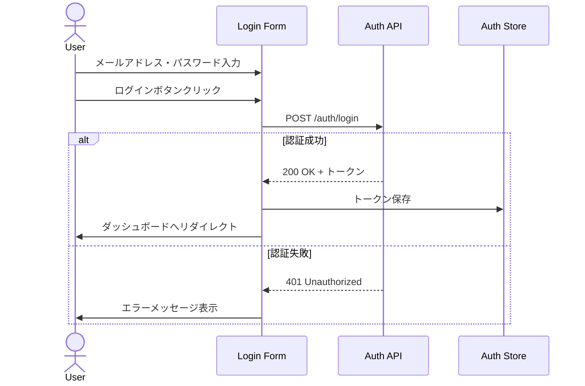
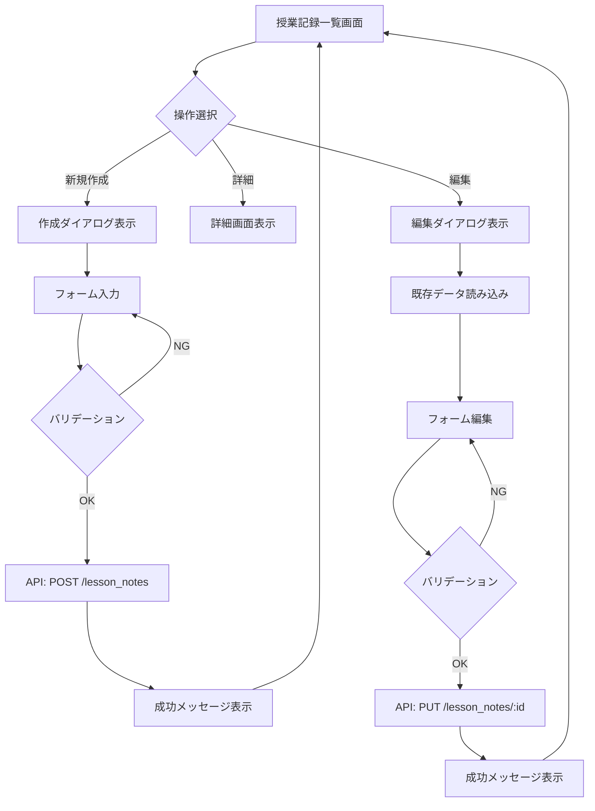
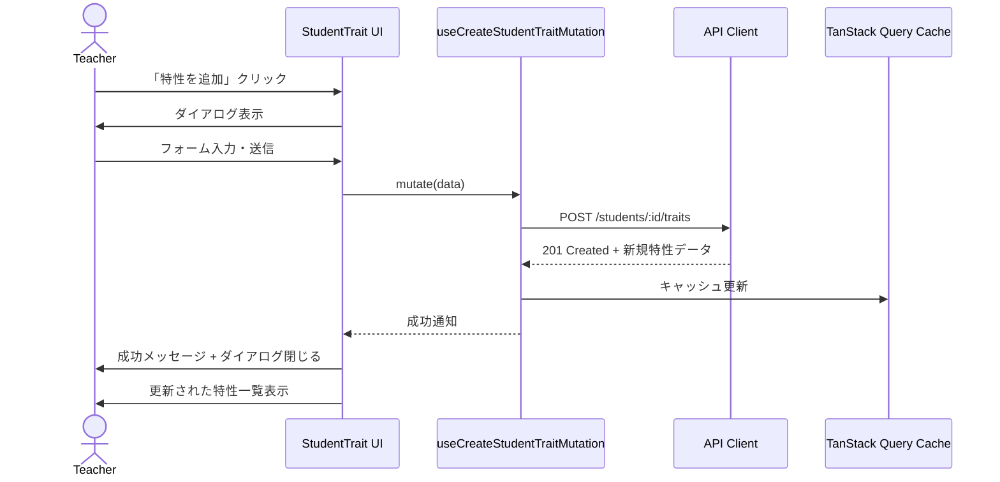
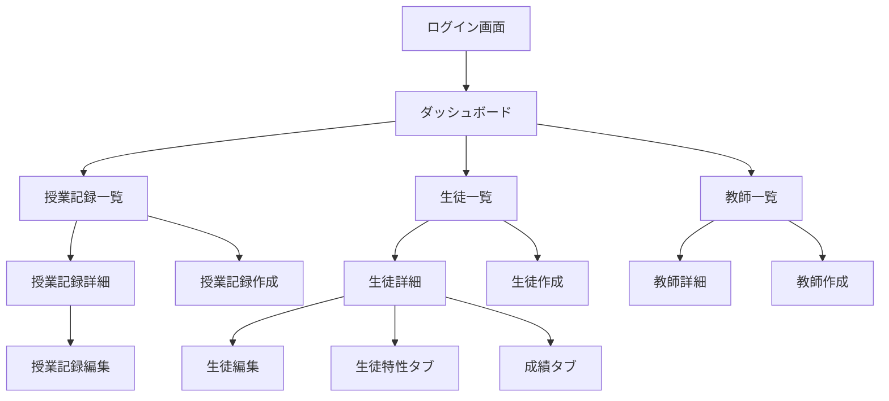

# 機能設計書

## 機能一覧

| 機能ID | 機能名 | カテゴリ | 優先度 | ステータス | 備考 |
|--------|--------|---------|--------|-----------|------|
| F-001 | ユーザー認証 | 認証・認可 | 必須 | 計画中 | ログイン・ログアウト |
| F-002 | 授業記録管理 | 授業管理 | 必須 | 計画中 | CRUD操作 |
| F-003 | 生徒情報管理 | 生徒管理 | 必須 | 計画中 | CRUD操作 |
| F-004 | 生徒特性管理 | 生徒管理 | 必須 | 計画中 | 特性の登録・表示 |
| F-005 | 教師管理 | 教師管理 | 高 | 計画中 | CRUD操作 |
| F-006 | 成績管理 | 生徒管理 | 高 | 計画中 | 成績入力・推移表示 |
| F-007 | ダッシュボード | 分析 | 高 | 計画中 | 概要表示 |
| F-008 | 検索・フィルタ | 共通 | 高 | 計画中 | 全機能横断 |
| F-009 | データエクスポート | 分析 | 中 | 計画中 | CSV/Excel出力 |
| F-010 | 通知機能 | 共通 | 中 | 計画中 | アプリ内通知 |

---

## F-001: ユーザー認証

### 概要
ユーザーがシステムにログインし、ロールに応じた機能にアクセスできるようにする。

### ユーザーストーリー
**As a** 教師または管理者
**I want to** メールアドレスとパスワードでログインしたい
**So that** 安全にシステムを利用できる

### 受入基準
**GIVEN** ユーザーがログイン画面にアクセスしている
**WHEN** 正しいメールアドレスとパスワードを入力して「ログイン」をクリックする
**THEN** ダッシュボード画面にリダイレクトされる
**AND** 認証トークンがローカルストレージに保存される

**GIVEN** ユーザーがログイン画面にアクセスしている
**WHEN** 誤ったメールアドレスまたはパスワードを入力して「ログイン」をクリックする
**THEN** エラーメッセージ「メールアドレスまたはパスワードが正しくありません」が表示される
**AND** ログイン画面のまま遷移しない

### 画面設計

#### ログイン画面
```
┌─────────────────────────────────────┐
│         Juku Cloud                   │
│                                      │
│  ┌────────────────────────────────┐ │
│  │ メールアドレス                   │ │
│  │ [____________________________] │ │
│  └────────────────────────────────┘ │
│                                      │
│  ┌────────────────────────────────┐ │
│  │ パスワード                       │ │
│  │ [____________________________] │ │
│  └────────────────────────────────┘ │
│                                      │
│  [ ログイン ]                        │
│                                      │
│  パスワードを忘れた方はこちら         │
└─────────────────────────────────────┘
```

### ワークフロー


### バリデーションルール

| 項目 | ルール | エラーメッセージ |
|------|--------|----------------|
| メールアドレス | 必須、Email形式 | 「有効なメールアドレスを入力してください」 |
| パスワード | 必須、8文字以上 | 「パスワードは8文字以上で入力してください」 |

### API仕様

#### POST /auth/login
**リクエスト:**
```json
{
  "email": "teacher@example.com",
  "password": "password123"
}
```

**レスポンス（成功）:**
```json
{
  "token": "eyJhbGciOiJIUzI1NiIsInR5cCI6IkpXVCJ9...",
  "user": {
    "id": 1,
    "name": "山田太郎",
    "email": "teacher@example.com",
    "role": "teacher"
  }
}
```

**レスポンス（失敗）:**
```json
{
  "error": "Invalid email or password"
}
```

---

## F-002: 授業記録管理（LessonNote）

### 概要
教師が授業後に授業内容、進捗、宿題などを記録し、過去の記録を参照できる。

### ユーザーストーリー
**As a** 教師
**I want to** 授業後に授業記録を作成したい
**So that** 授業内容を忘れずに記録し、次回の授業に活かせる

### 受入基準
**GIVEN** 教師が授業記録一覧画面にいる
**WHEN** 「新規作成」ボタンをクリックする
**THEN** 授業記録作成ダイアログが開く

**GIVEN** 授業記録作成ダイアログが開いている
**WHEN** 必須項目（生徒、日付、内容）を入力して「保存」をクリックする
**THEN** 授業記録が保存される
**AND** 成功メッセージが表示される
**AND** 一覧画面に新しい記録が表示される

### 画面設計

#### 授業記録一覧画面
```
┌─────────────────────────────────────────────────────────────┐
│ 授業記録                                   [ + 新規作成 ]     │
├─────────────────────────────────────────────────────────────┤
│ 検索: [___________]  フィルタ: [全て▼] [生徒▼] [日付▼]     │
├─────────────────────────────────────────────────────────────┤
│ 日付       │ 生徒      │ 内容                │ 操作        │
├─────────────────────────────────────────────────────────────┤
│ 2025-01-15 │ 田中一郎  │ 数学:二次関数       │ [詳細][編集]│
│ 2025-01-14 │ 佐藤花子  │ 英語:不定詞         │ [詳細][編集]│
│ 2025-01-13 │ 鈴木次郎  │ 数学:因数分解       │ [詳細][編集]│
└─────────────────────────────────────────────────────────────┘
                        [ < 前へ ] 1/5 [ 次へ > ]
```

#### 授業記録作成ダイアログ
```
┌───────────────────────────────────────┐
│ 授業記録を作成                    [×] │
├───────────────────────────────────────┤
│ 生徒 *                                │
│ [生徒を選択 ▼]                        │
│                                       │
│ 実施日 *                              │
│ [2025-01-15 ▼]                       │
│                                       │
│ 科目                                  │
│ [数学 ▼]                             │
│                                       │
│ 授業内容 *                            │
│ ┌───────────────────────────────────┐ │
│ │二次関数の基礎                      │ │
│ │グラフの書き方を学習                │ │
│ └───────────────────────────────────┘ │
│                                       │
│ 進捗状況                              │
│ ┌───────────────────────────────────┐ │
│ │予定通り進んでいる                  │ │
│ └───────────────────────────────────┘ │
│                                       │
│ 宿題                                  │
│ ┌───────────────────────────────────┐ │
│ │問題集p.45-48                       │ │
│ └───────────────────────────────────┘ │
│                                       │
│         [ キャンセル ]  [ 保存 ]       │
└───────────────────────────────────────┘
```

### ワークフロー


### バリデーションルール

| フィールド | ルール | エラーメッセージ |
|-----------|--------|----------------|
| 生徒 | 必須 | 「生徒を選択してください」 |
| 実施日 | 必須、過去または当日 | 「実施日を入力してください」 |
| 授業内容 | 必須、最大1000文字 | 「授業内容は1000文字以内で入力してください」 |
| 進捗状況 | 最大500文字 | 「進捗状況は500文字以内で入力してください」 |
| 宿題 | 最大500文字 | 「宿題は500文字以内で入力してください」 |

### データモデル

> **注意**: 以下は概念モデルです。実際の実装はバックエンドAPI仕様に従います。
> 詳細は [CLAUDE.md](../CLAUDE.md#sddと実装の関係) を参照してください。

```typescript
interface LessonNote {
  id: number;
  studentId: number;
  teacherId: number;
  lessonDate: string; // ISO 8601 format
  subject: string;
  content: string;
  progress: string;
  homework: string;
  createdAt: string;
  updatedAt: string;
}
```

---

## F-004: 生徒特性管理（StudentTrait）

### 概要
教師が生徒の性格や行動パターン、学習特性を記録し、指導に活かす。

### ユーザーストーリー
**As a** 教師
**I want to** 生徒の特性（良い点・注意点）を記録したい
**So that** 個々の生徒に合わせた指導ができる

### 受入基準
**GIVEN** 教師が生徒詳細画面の「特性」タブにいる
**WHEN** 「特性を追加」ボタンをクリックする
**THEN** 特性追加ダイアログが開く

**GIVEN** 特性追加ダイアログが開いている
**WHEN** カテゴリ、タイトル、説明を入力して「保存」をクリックする
**THEN** 特性が保存される
**AND** 成功メッセージが表示される
**AND** 特性一覧に新しい特性が表示される

### 画面設計

#### 生徒詳細画面 - 特性タブ
```
┌─────────────────────────────────────────────────────────┐
│ 田中一郎                                                 │
│ [ 基本情報 ] [ 授業記録 ] [ 特性 ] [ 成績 ]              │
├─────────────────────────────────────────────────────────┤
│ 生徒特性                               [ + 特性を追加 ]  │
├─────────────────────────────────────────────────────────┤
│ 【よい特性】                                             │
│ ┌───────────────────────────────────────────────────┐   │
│ │ まじめな性格                          2025-01-10   │   │
│ │ 授業に集中して取り組む。宿題も必ずやってくる。    │   │
│ │                                          [削除]     │   │
│ └───────────────────────────────────────────────────┘   │
│                                                          │
│ ┌───────────────────────────────────────────────────┐   │
│ │ 質問が多い                            2025-01-05   │   │
│ │ 分からないことをすぐに質問してくれる。            │   │
│ │                                          [削除]     │   │
│ └───────────────────────────────────────────────────┘   │
│                                                          │
│ 【注意が必要な特性】                                     │
│ ┌───────────────────────────────────────────────────┐   │
│ │ ケアレスミスが多い                    2025-01-08   │   │
│ │ 計算ミスや転記ミスが目立つ。見直しを促す必要あり。│   │
│ │                                          [削除]     │   │
│ └───────────────────────────────────────────────────┘   │
└─────────────────────────────────────────────────────────┘
```

#### 特性追加ダイアログ
```
┌───────────────────────────────────────┐
│ 生徒特性を追加                    [×] │
├───────────────────────────────────────┤
│ カテゴリ *                            │
│ ○ よい特性                            │
│ ○ 注意が必要な特性                    │
│                                       │
│ タイトル *                            │
│ [____________________________]        │
│                                       │
│ 説明                                  │
│ ┌───────────────────────────────────┐ │
│ │                                    │ │
│ │                                    │ │
│ │                                    │ │
│ └───────────────────────────────────┘ │
│                                       │
│         [ キャンセル ]  [ 保存 ]       │
└───────────────────────────────────────┘
```

### ワークフロー


### バリデーションルール

| フィールド | ルール | エラーメッセージ |
|-----------|--------|----------------|
| カテゴリ | 必須、'good' または 'careful' | 「カテゴリを選択してください」 |
| タイトル | 必須、最大50文字 | 「タイトルは50文字以内で入力してください」 |
| 説明 | 最大500文字 | 「説明は500文字以内で入力してください」 |

### データモデル

> **注意**: 以下は概念モデルです。実際の実装はバックエンドAPI仕様に従います。
> 詳細は [CLAUDE.md](../CLAUDE.md#sddと実装の関係) を参照してください。

```typescript
interface StudentTrait {
  id: number;
  studentId: number;
  category: 'good' | 'careful';
  title: string;
  description: string;
  createdAt: string;
  updatedAt: string;
}
```

### API仕様

#### POST /students/:studentId/traits
**リクエスト:**
```json
{
  "category": "good",
  "title": "まじめな性格",
  "description": "授業に集中して取り組む。宿題も必ずやってくる。"
}
```

**レスポンス:**
```json
{
  "id": 123,
  "studentId": 45,
  "category": "good",
  "title": "まじめな性格",
  "description": "授業に集中して取り組む。宿題も必ずやってくる。",
  "createdAt": "2025-01-15T10:30:00Z",
  "updatedAt": "2025-01-15T10:30:00Z"
}
```

---

## F-006: 成績管理

### 概要
生徒の成績を入力し、推移をグラフで可視化する。

### ユーザーストーリー
**As a** 教師
**I want to** 生徒の成績を入力して推移を確認したい
**So that** 学習効果を定量的に評価できる

### 受入基準
**GIVEN** 生徒詳細画面の「成績」タブにいる
**WHEN** 成績データが複数回登録されている
**THEN** 折れ線グラフで成績の推移が表示される
**AND** 科目ごとにフィルタリングできる

### 画面設計

#### 成績タブ
```
┌─────────────────────────────────────────────────────────┐
│ 田中一郎                                                 │
│ [ 基本情報 ] [ 授業記録 ] [ 特性 ] [ 成績 ]              │
├─────────────────────────────────────────────────────────┤
│ 成績推移                  科目: [全て▼]  [ + 成績追加 ] │
├─────────────────────────────────────────────────────────┤
│   100┼                                                   │
│      │                                      ●            │
│    80┼                          ●                        │
│      │                 ●                                 │
│    60┼        ●                                          │
│      │                                                   │
│    40┼                                                   │
│      │                                                   │
│    20┼                                                   │
│      │                                                   │
│     0└────┴────┴────┴────┴────┴────┴────┴────           │
│      10/1  11/1  12/1  1/1   2/1   3/1                  │
│                                                          │
│ 成績履歴                                                 │
│ ┌───────────┬─────┬─────┬─────────────────────┐         │
│ │ 日付      │科目 │点数 │ メモ                │         │
│ ├───────────┼─────┼─────┼─────────────────────┤         │
│ │2025-01-15 │数学 │ 85  │二次関数テスト       │ [編集] │
│ │2024-12-20 │数学 │ 78  │期末テスト           │ [編集] │
│ │2024-11-25 │数学 │ 72  │中間テスト           │ [編集] │
│ └───────────┴─────┴─────┴─────────────────────┘         │
└─────────────────────────────────────────────────────────┘
```

### データモデル

> **注意**: 以下は概念モデルです。実際の実装はバックエンドAPI仕様に従います。
> 詳細は [CLAUDE.md](../CLAUDE.md#sddと実装の関係) を参照してください。

```typescript
interface Grade {
  id: number;
  studentId: number;
  subject: string;
  score: number; // 0-100
  examDate: string;
  memo: string;
  createdAt: string;
  updatedAt: string;
}
```

---

## F-007: ダッシュボード

### 概要
塾全体の概要や個人の活動状況を一目で把握できるダッシュボード。

### ユーザーストーリー
**As a** 教師
**I want to** ダッシュボードで今日の授業予定と最近の記録を確認したい
**So that** 一日の業務をスムーズに開始できる

**As a** 管理者
**I want to** 塾全体の授業実施状況を確認したい
**So that** 運営上の問題を早期に発見できる

### 画面設計（教師向け）

```
┌─────────────────────────────────────────────────────────┐
│ ダッシュボード                                           │
├─────────────────────────────────────────────────────────┤
│ ┌─────────────────┐  ┌─────────────────┐                │
│ │ 今日の授業      │  │ 最近の記録      │                │
│ │ 5件             │  │ 12件（7日間）   │                │
│ └─────────────────┘  └─────────────────┘                │
│                                                          │
│ 今日の授業スケジュール                                   │
│ ┌──────────────────────────────────────────────┐        │
│ │ 14:00 - 15:30  田中一郎  数学:二次関数       │        │
│ │ 16:00 - 17:30  佐藤花子  英語:不定詞         │        │
│ │ 18:00 - 19:30  鈴木次郎  数学:因数分解       │        │
│ └──────────────────────────────────────────────┘        │
│                                                          │
│ 最近の授業記録                                           │
│ ┌──────────────────────────────────────────────┐        │
│ │ 2025-01-15  田中一郎  数学:二次関数          │        │
│ │ 2025-01-14  佐藤花子  英語:不定詞            │        │
│ │ 2025-01-13  鈴木次郎  数学:因数分解          │        │
│ └──────────────────────────────────────────────┘        │
│                                     [ すべて見る ]       │
└─────────────────────────────────────────────────────────┘
```

---

## 共通UI要素

### ナビゲーション

```
┌─────────────────────────────────────────────────────────┐
│ ≡ Juku Cloud                    山田太郎 [⚙] [ログアウト]│
├─────────────────────────────────────────────────────────┤
│ サイドバー                                               │
│ ┌─────────────┐                                         │
│ │ 🏠 ダッシュボード                                       │
│ │ 📝 授業記録                                             │
│ │ 👨‍🎓 生徒管理                                             │
│ │ 👨‍🏫 教師管理                                             │
│ │ 📊 分析                                                 │
│ │ ⚙️ 設定                                                 │
│ └─────────────┘                                         │
└─────────────────────────────────────────────────────────┘
```

### 通知メッセージ

- **成功**: 緑色のトースト通知（右上に3秒間表示）
- **エラー**: 赤色のトースト通知（右上に5秒間表示）
- **警告**: 黄色のトースト通知（右上に4秒間表示）

### ローディング状態

- **ページ全体**: スケルトンスクリーン
- **データ取得中**: スピナー表示
- **ボタン押下後**: ボタン内にスピナー + 非活性化

---

## 画面遷移図



---

## 変更履歴

| 日付 | バージョン | 変更内容 | 担当者 |
|------|-----------|---------|--------|
| 2025-12-31 | 1.0 | 初版作成 | - |
